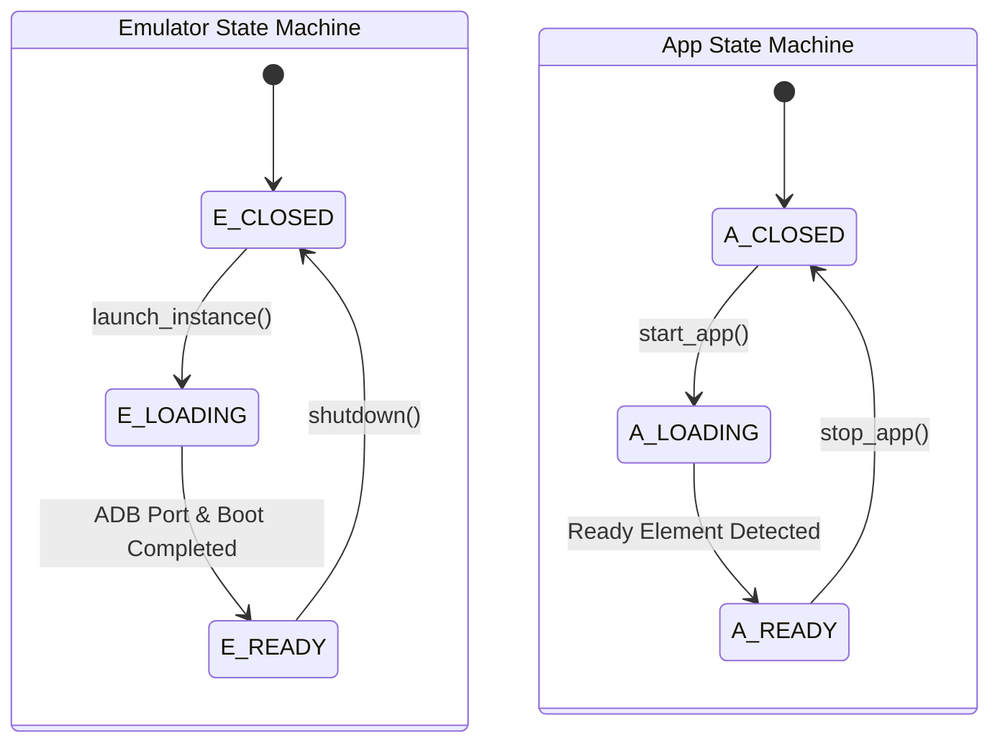

---
type: Architecture Specification
title: "PymordialBlue — BlueStacks Controller & Process Lifecycle"
description: "Architecture of BluestacksController, HD-Player.exe process management, configuration parsing from bluestacks.conf, and dual emulator/app state machines."
resource: package:pymordialblue
tags: [pymordialblue, bluestacks, architecture, controller, process-management, state-machine]
status: stable
generated:
  by: human:IAmNo1Special
  at: 2026-09-16T12:00:00Z
verified:
  - by: human:IAmNo1Special
    at: 2026-09-16T12:00:00Z
sources:
  - id: pymordialblue-source
    resource: package:pymordialblue
    title: "PymordialBlue Package"
---

# PymordialBlue — BlueStacks Controller & Process Lifecycle

PymordialBlue provides native integration with BlueStacks 5 Android emulator, coordinating host process management, dynamic bridge negotiation, and automated fault recovery.

---

## 1. Controller Overview (`BluestacksController`)

Inheriting from `PymordialController`, the `BluestacksController` coordinates:
- **BlueStacks Device (`BluestacksDevice`)**: Implements `EmulatorDevice` blueprint.
- **Process Orchestration**: Detects, launches, and terminates `HD-Player.exe`.
- **Instance Configuration**: Parses `bluestacks.conf` to dynamically identify instance names, assigned ADB ports, and display configurations.

---

## 2. Dual State Machine Architecture

PymordialBlue manages stability through two distinct, concurrent state layers:

1. **Emulator State**: Tracks the desktop hypervisor process (`CLOSED` $\rightarrow$ `LOADING` $\rightarrow$ `READY`).
2. **App State**: Tracks the guest Android game/app lifecycle once the emulator bridge is verified healthy.

---

## 3. Instance Configuration Auto-Discovery

PymordialBlue avoids hardcoded ports by inspecting the local Windows registry and installation filesystem:
- **Registry Key**: `HKLM\SOFTWARE\BlueStacks_nxt` $\rightarrow$ resolves `UserDefinedDir` and `ProgramDir`.
- **Config Parser**: Reads `bluestacks.conf` (e.g. `bst.instance.Nougat64.status.adb_port = 5555`).

See also: [ADB & Streaming](./adb_and_streaming.md) and [Vision & OCR](./vision_and_ocr.md).