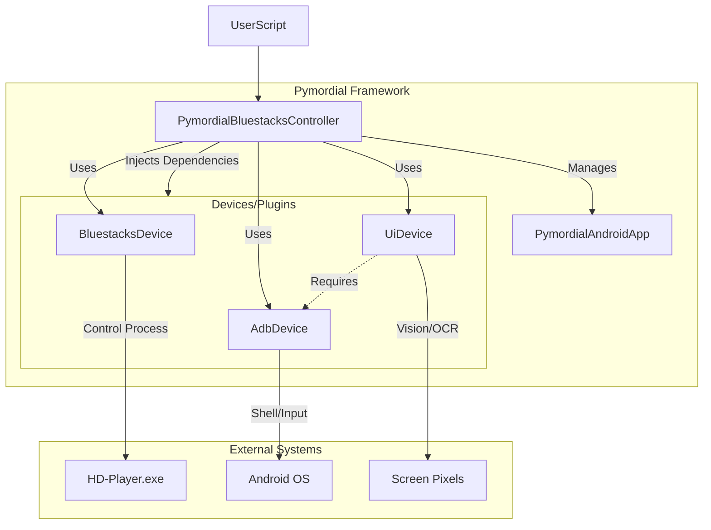

# Architecture

PymordialBlue follows a controller-device-plugin architecture designed to decouple high-level logic (what to do) from low-level implementation (how to do it).

## Mental Model

## Key Components

### Controller
The **Controller** (`PymordialBluestacksController`) is the central brain. It:
1.  **Initializes Plugins**: Loads ADB, UI, and BlueStacks devices.
2.  **Orchestrates Work**: Ensures BlueStacks is open before connecting ADB.
3.  **Manages Apps**: Tracks which apps are open, closed, or loading.

### Devices (Plugins)
Pymordial is built on replaceable "Devices".

*   **AdbDevice**: wrappers `adb-shell`. Handles all direct communication with the Android environment inside BlueStacks. It also manages the high-speed video stream.
*   **UiDevice**: wrappers OpenCV and Tesseract. It provides the "eyes". It uses `AdbDevice` to fetch the screen image (via stream or screencap) and analyze it.
*   **BluestacksDevice**: wrappers `psutil`. It manages the actual Windows process (`HD-Player.exe`), handling startup and shutdown.

### Dependency Injection
The System uses dependency injection to link plugins.
*   `UiDevice` needs `AdbDevice` to get screenshots.
*   `BluestacksDevice` needs `AdbDevice` to connect once the process is ready.

This is handled automatically by the Controller during initialization.
